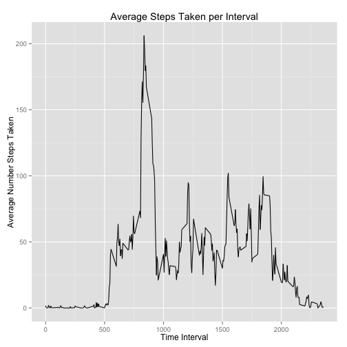
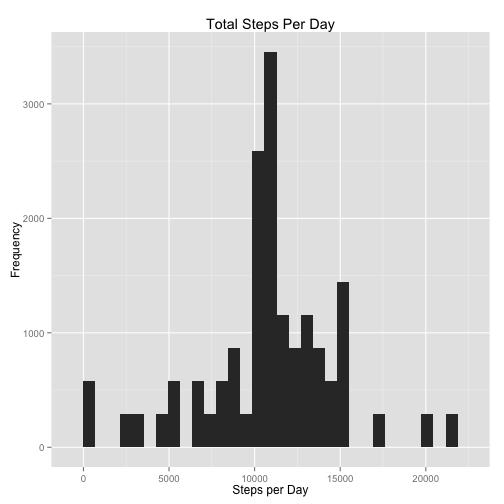
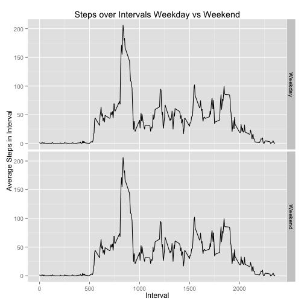

###Chunk one: Read in the data


```r
#File was downloaded from course assingment page on 1/8/16 
raw <- read.csv("~/Downloads/activity.csv")

library(dplyr)
library(ggplot2)
```

###Chunk two: What is the Average Total Number of Steps Taken per Day?


```r
#Ignore all NA
#Group the data by day and calculate sum of steps per day in new column called sum

raw2 <- raw %>%
  na.omit()%>%
  group_by(date) %>%
  mutate(sum=sum(steps))

#Plot a histogram of the steps taken per day
ggplot(raw2, aes(sum)) +
  geom_histogram() +
  xlab("Steps per Day") +
  ylab("Frequency") +
  ggtitle("Total Steps Per Day")
```

```
## stat_bin: binwidth defaulted to range/30. Use 'binwidth = x' to adjust this.
```

 

```r
#Calculate the mean number of steps taken per day  
mean(raw2$sum)
```

```
## [1] 10766.19
```

```r
#Calculate the median number of steps taken per day
median(raw2$sum)
```

```
## [1] 10765
```

The *mean* number of steps taken per day is **1066.19**

The *median* number of steps taken per day is **10765**

###Chunk three: What is the Average Daily Activity Pattern?


```r
#add a new column called int.act which stands for the average number of steps taken in that interval over all days

raw3 <- raw2 %>%
  ungroup() %>%
  group_by(interval)%>%
  mutate(int.act = mean(steps))

#Plot the time intervals on the x axis with average steps taken in that time interval across all days on the y axis
ggplot(raw3, aes(interval,int.act)) +
  geom_line() +
  xlab("Time Interval") +
  ylab("Average Number Steps Taken") +
  ggtitle("Average Steps Taken per Interval")
```

 

```r
#Select the rows where the int.act value is the maximum number of steps
raw4 <- raw3 %>%
  filter(int.act == max(raw3$int.act))

raw4$interval[1]
```

```
## [1] 835
```

Time interval **835** contains the most activity on average.

###Chunk four: Imputing Missing Values


```r
#Back to the raw data with the NAs in it
#Count the number of NAs in the dataset
sum(is.na(raw))
```

```
## [1] 2304
```

```r
#There are 2304 rows with NAs

#Imputing the NAs..
#make a new df called clean, which is the df without NAs
clean <- raw3 %>%
  #select only the interval and the average steps in that interval (computed w/o NAs)
  select(interval, int.act)%>%
  #and we only need one average activity value for each interval
  unique()

#Now lets join the df with NAs to the clean df
imputeddf <- left_join(raw,clean) %>%
  #And if the steps column is NA we will fill it in with the average steps for that interval
  mutate(steps = ifelse(is.na(steps), int.act, steps))
```

```
## Joining by: "interval"
```

```r
#Now make a new data frame with all imputed and existing values, find steps per day
newest <- imputeddf %>%
  group_by(date) %>%
  mutate(totalsteps = sum(steps))

ggplot(newest, aes(totalsteps)) +
  geom_histogram() +
  xlab("Steps per Day") +
  ylab("Frequency") +
  ggtitle("Total Steps Per Day")
```

```
## stat_bin: binwidth defaulted to range/30. Use 'binwidth = x' to adjust this.
```

 

```r
summary(newest$totalsteps)
```

```
##    Min. 1st Qu.  Median    Mean 3rd Qu.    Max. 
##      41    9819   10770   10770   12810   21190
```

The new mean total number of steps per day is **10770**
The new median total number of steps per day is **10770**

##Chunk Five: Tracking Weekday and Weekend Activity with Imputed Values


```r
library(lubridate)
#Make a new dataframe called days. dayofweek reflects if the day was a weekday or weekend.
days <- newest %>%
  mutate(dayofweek = ifelse(wday(date) %in% c(1,7), "Weekend", "Weekday"))
days$dayofweek <- as.factor(days$dayofweek)
#Plot patterns between weekday and weekend activity
ggplot(days, aes(interval, int.act)) +
  geom_line() +
  facet_grid(dayofweek~.) +
  ylab("Average Steps in Interval") +
  xlab("Interval") +
  ggtitle("Steps over Intervals Weekday vs Weekend")
```

 
